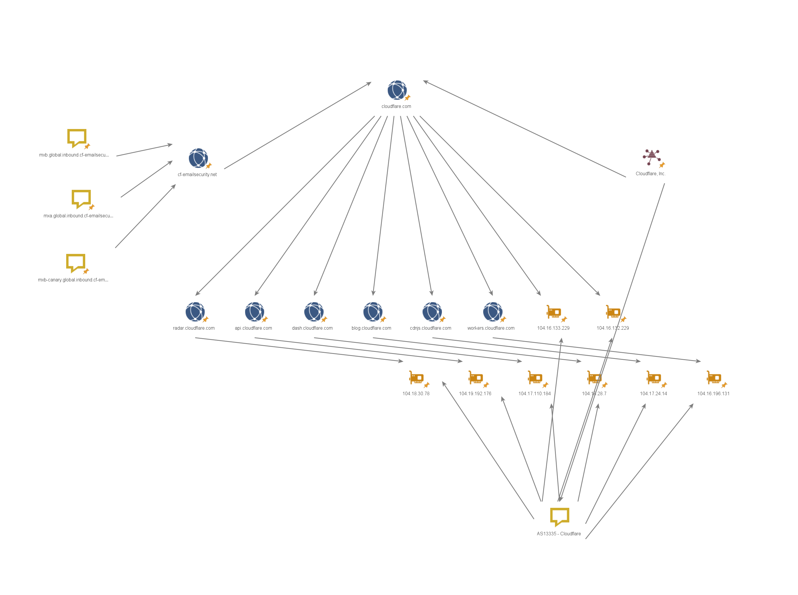

# OSINT Infrastructure Mapping — Cloudflare

> Open Source Intelligence analysis using Maltego Community Edition to map and correlate Cloudflare's public digital infrastructure.

---

## Objective

Map publicly available infrastructure data related to Cloudflare, Inc.,
correlating domains, subdomains, IPs, ASN, and email infrastructure
using OSINT techniques and visual link analysis via Maltego CE.

---

## Methodology

This project follows a structured OSINT investigation workflow:

1. **Subdomain Enumeration** — Certificate Transparency logs via crt.sh
2. **DNS Analysis** — Active A and MX record lookup via dnschecker.org
3. **Whois / RDAP** — Domain registration and IP ownership via who.is
4. **ASN Mapping** — Autonomous System identification and IP block analysis
5. **Link Analysis** — Entity correlation and graph construction via Maltego CE

All data collected from public sources only. No active scanning performed.

---

## Tools

| Tool | Purpose |
|---|---|
| Maltego Community Edition | Link analysis and graph construction |
| crt.sh | Certificate transparency / subdomain enumeration |
| dnschecker.org | DNS record lookup (A, MX) |
| who.is | Whois and IP ownership lookup |

---

## Key Findings

- Cloudflare operates its entire public infrastructure on its own ASN (AS13335)
- IP space is segmented by service function within the 104.16.0.0/12 block (1M+ IPs)
- All services use anycast routing — consistent global DNS resolution confirmed
- Corporate email runs on cf-emailsecurity.net — Cloudflare's own email security product
- Cloudflare self-registers its own domains using its own registrar and WHOIS server
- Canary deployment server identified via public MX record (mxb-canary)

---

## Graph

---

## Disclaimer

This project was conducted exclusively using public data sources.  
No systems were accessed without authorization.  
All findings are based on openly available information.

---

## Author

Paulo Vaz

https://www.linkedin.com/in/paulohvz/
